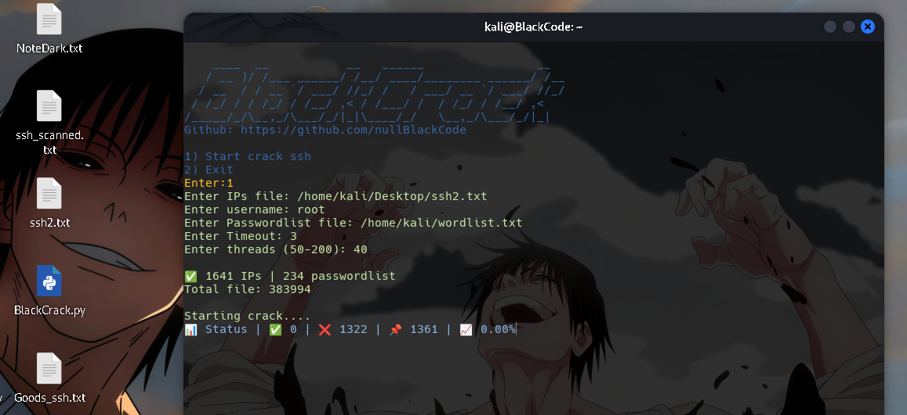
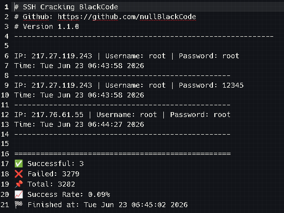

# BlackCrackSSH 
Brute force ssh | python script

It is an SSH cracking tool, but it is not very advanced and professional, but it is ready and useful. It has a simple user interface and an attempt has been made to write the script in a light way so that the user does not encounter any problems.
In the future, we will add more features and make it more professional.

It may stop the operation while working. We have concluded that it may be due to the size of the user's input files to the script, but this problem will be completely resolved in the future.

The speed of the script's operation and performance may differ slightly from the user's inputs, which may be due to the speed of the internet in your area or the system's hardware, which will be fully investigated in the future.
Overall, this script is useful.

version GUI new add!

## Installing dependencies:

Debian/Ubuntu/Kali Linux:
```bash
sudo apt-get update && sudo apt-get install -y libssh2-1 libssh2-1-dev libssl-dev zlib1g-dev build-essential ca-certificates
```

CentOS/RHEL/Fedora:
```bash
sudo yum install -y libssh2 libssh2-devel openssl-devel zlib-devel gcc make
```

Alpine Linux (Docker):
```bash
apk add --no-cache libssh2 libssh2-dev openssl-dev zlib-dev gcc musl-dev
```
Arch Linux:
```bash
sudo pacman -S libssh2 openssl zlib gcc make
```
OpenSUSE:
```bash
sudo zypper install -y libssh2-1 libssh2-devel libopenssl-devel zlib-devel gcc make
```

-----------------------------------------

The .abj file format must have a port and an additional word for the script and module to work properly, for example:
0.0.0.0
1.2.3.4
192.151.0.1
193.0.0.1
...

-----------------------------------------



Successful file output:



Versoin GUI:


> Telegram channel: https://t.me/zeroBlackCode 
